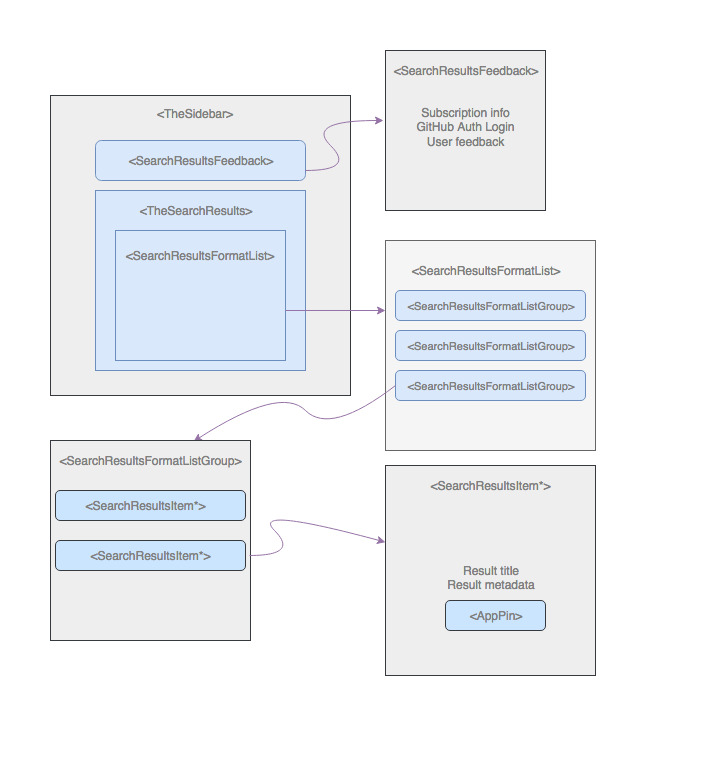
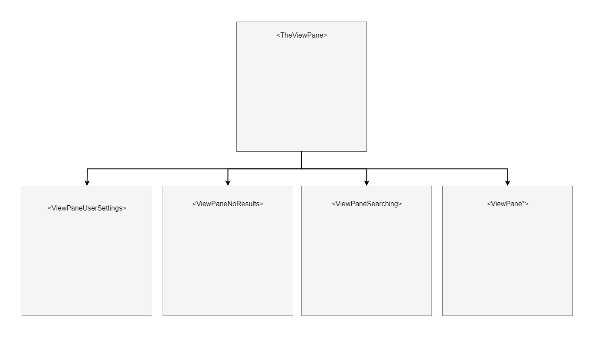
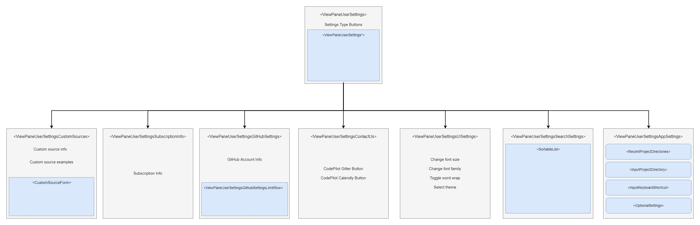
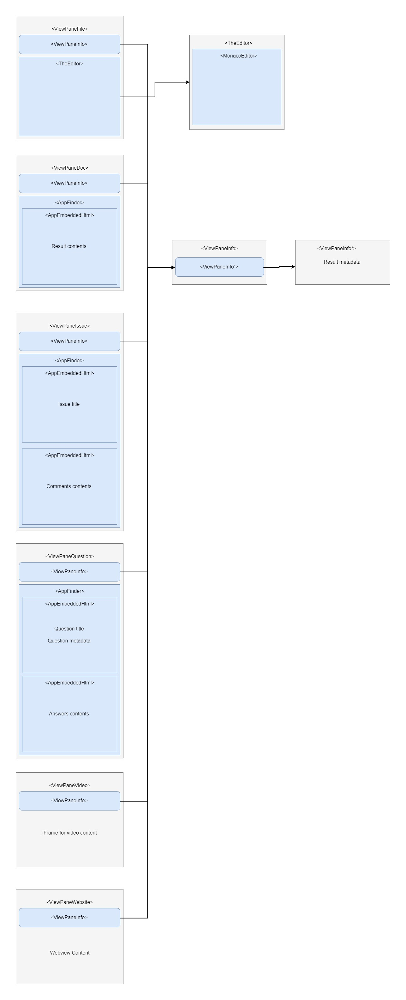

# Renderer

This folder was also generated by the Electron template and is where we're keeping all our UI-specific code, including all Vue code, application state, and visual assets.

## Components

##### A high-level overview of our Vue components

1. ##### TheSidebar

   `TheSidebar` component is responsible for displaying essential details about a     user's search results - whether it be the results themselves (shown in `TheSearchResults` component) or directions to provide feedback about those results (presented in `SearchResultsFeedback`).

   Relevant files: `./components/the-sidebar.vue`, `./components/the-search-results.vue`, and `./components/search-results-feedback.vue`.
   * ##### SearchResultsFeedback

     The `SearchResultsFeedback` component is significant in that it offers a way for a user to provide feedback as to whether or not the search results are useful. The aforementioned component also notifies the user about their current subscription plan and offers a way to authorize GitHub to allow GitHub searches.

   * ##### TheSearchResults

     The `TheSearchResults` component is instrumental in displaying to the user various search results. When the user enters a search query, one of our services receives the query, performs the search in the respective sources, and returns an RxJS stream containing search results for said query. Search results can be customized, thanks to the `resultsMapper` function, but typically contain the following properties:

         type: String, // type of results. For instance question, commit, doc, etc.
         source: String, // the kind of search that is to be done
         key: String | Number, // some unique key
         codepilotScore: Float, // ranked result score
         timestamp: Float

      A result may also contain a `file`, `url`, `author`, `labels`, and a multitude of additional metadata where appropriate.

      Relevant files: `./state/modules/search/sources.js`

     Inside `TheSearchResults`, results are rendered inside the `SearchResultsFormatList` component. `SearchResultsFormatList` is responsible for iterating over the list of result groups and passing in as props each result group to the `SearchResultsFormatListGroup` component. The list of result groups display as collapsible content (accordion) items within the sidebar.

     Each results group item is a `SearchResultsFormatListGroup` component that includes a `ProgressBar` component that shows loading status of results, the number of results, and finally, the actual results for that group. The result is passed as props to any component of type `search-results-item*`. Each `SearchResultItem*`component has, at the very least, a title for that result and an `AppPin` component that, when clicked, bookmarks that particular result.

     To better understand how results are displayed in the sidebar, and how the apposite components are structured, see diagram below:

     

     Relevant files: `./components/search-results-format-list.vue`, `./components/search-results-format-list-group.vue`, `./components/search-results-item*.vue`, `./components/search-results-item.vue`, and `./components/app-pin-button.vue`.

2. ##### TheViewPane

    `TheViewPane` component is responsible for displaying the content of not only the user's selected search results but also what we want them to see when either a search is still in progress or no results were found. It is also where we display user's settings (presented in `ViewPaneUserSettings`).

    This is all determined by the `viewable` object based off of it's `type` property. Currently types `file`, `doc`, `issue`, `question`, `searchingPending`, `noResults`, `website` and `video` are accounted for. If the `viewable` is none of those, then `TheViewPane` defaults to displaying `ViewPaneUserSettings`.

    

    Relevant files: `./components/the-view-pane.vue`, `./components/view-pane-user-settings.vue`, `./components/view-pane-no-results.vue`, `./components/view-pane-searching.vue`

  * ##### ViewPaneUserSettings

    While `ViewPaneUserSettings` is very important to letting the user configure the application to work the way they want, it is not exactly in this component but rather subcomponents that most of the configuration occurs.

    

    Relevant files: `./components/view-pane-user-settings-app-settings.vue`, `./components/view-pane-user-settings-search-settings.vue`, `./components/view-pane-user-settings-custom-sources.vue`, `./components/view-pane-user-settings-github-settings.vue`, `./components/view-pane-user-settings-subscription-info.vue`, `./components/view-pane-user-settings-ui.settings.vue`

  * ##### ViewPane - Result Types

    As mentioned prior, when set to one of the types that is associated with a result (i.e. `file`, `doc`, `issue`, `question`, etc.), the corresponding view pane is displayed with with `ViewPane{Type}`. Each of these components has their own way of displaying the results inside of the `viewable` object whether that be code with the Monaco editor, markdown/html contents, a video or a website.

    Each of these component types also has a `ViewPaneInfo` component that displays metadata about that result.

    * ##### ViewPaneInfo

      The `ViewPaneInfo` component has a very prominent role in delivering information to the user about the result they have selected. While the result types view pane displays the actual contents of the result, `ViewPaneInfo` is responsible for the metadata associated with that result such as what repo or question a result is associated with, who created the said repo or question, when the result was last updated, and also navigation abilities for web searches/custom sources.

      Relevant files: `./components/view-pane-info-github-code.vue`, `./components/view-pane-info-github-commits.vue`, `./components/view-pane-info-github-issues.vue`, `./components/view-pane-info-github-pr.vue`, `./components/view-pane-github-markdown.vue`, `./components/view-pane-info-local.vue`, `./components/view-pane-info-stack-overflow.vue`, `./components/view-pane-info-web-searches.vue`, `./components/view-pane-info-youtube.vue`

    

    Relevant files: `./components/view-pane-doc.vue`, `./components/view-pane-file.vue`, `./components/view-pane-issue.vue`,
    `./components/view-pane-pr.vue`, `./components/view-pane-question.vue`, `./components/view-pane-video.vue`, `./components/view-pane-website.vue`

